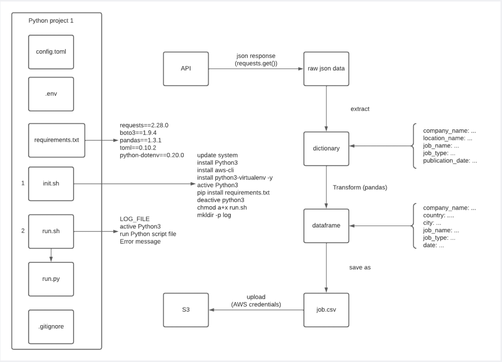

### **Project Title**  
**Job Data Processing and Storage in AWS Cloud**

### **Project Description**  
This mini project involves developing a Python-based data engineering pipeline to extract, transform, and load (ETL) job data from an API into an AWS S3 bucket. The project simulates real-world scenarios of working with APIs, managing cloud resources, and implementing ETL workflows for structured data processing.  

---

### **Scenario**  
The project retrieves job data from the Muse API, focusing on Page 50 of the job listings. The extracted data is transformed into a structured format and stored securely in AWS S3 for further analysis. This project is designed to be deployed and run on an EC2 instance, leveraging both Python and AWS tools for automation and scalability.

---

### **Project Architecture**  


---

### **Technical Details**  
1. **Data Extraction:**  
   - Used Python's `requests` library to query the API at `https://www.themuse.com/api/public/jobs?page=50`.  
   - Extracted fields of interest:  
     - **Company Name**  
     - **Locations**  
     - **Job Name**  
     - **Job Type**  
     - **Publication Date**  

2. **Data Transformation:**  
   - Converted the JSON response to a Pandas DataFrame.  
   - Parsed and cleaned data:  
     - Extracted **city** and **country** from the "locations" field.  
     - Formatted the "publication date" to include only the date.  
   - Renamed columns for clarity:  
     - `company.name` → `company_name`  
     - `name` → `job_name`  
     - `type` → `job_type`  
     - `publication_date` → `date`  

3. **Data Storage:**  
   - Saved the transformed data as a Parquet file for efficient storage and retrieval.  
   - Used **AWS S3** for data storage:  
     - [X]Option 1: Used `boto3` with AWS credentials to programmatically upload the file.  
     - []Option 2: Configure IAM roles for the EC2 instance and use AWS CLI (`aws s3 cp`) to upload the file.  

4. **Automation:**  
   - Created a shell script to initialize the project environment, set up virtual environments, and run the Python script.  
   - Used configuration files (e.g., `.env` for secrets, `.toml` for parameters) to decouple settings from the code.  

5. **Environment Setup:**  
   - Deployed the project on an AWS EC2 instance.  
   - Used VSCode for remote SSH access to EC2 for code development and debugging.

6. **Server Used:**
   - `MiniProject`: a t2.micro EC2 instance
---

### **Tools Used**
- Python
   - Pandas
   - Boto3
   - Numpy
   - Requests
- AWS EC2
- AWS S3
- Shell
- VSCode

### **Project Structure**  
- **`.v_env`**: Python virtual environment.  
- **`requirements.txt`**: Contains the dependency packages required for this project.  
- **`config.toml`**: Contains API and AWS parameters for configuring the project.  
- **`.env`**: Contains API and AWS secrets.  
- **`script/init.sh`**: Shell script to set the environment variables and initiate the project.  
- **`script/run.py`**: Python ETL script for extracting, transforming, and loading the data.  
- **`script/run.sh`**: Shell script to control the execution of:  
   - The initialization script.  
   - The Python script (in either test mode or production mode).  
- **`logs/`**: Contains log files for debugging and auditing.  
- **`.gitignore`**: Specifies files to ignore in version control.

---

### **Running the Project**  
Run the project as follows:  

```bash
# This will run the project in production mode
bash ./script/run.sh
```

---

### **Resources**  
- [API Documentation](https://muse.ai/api#flow)
